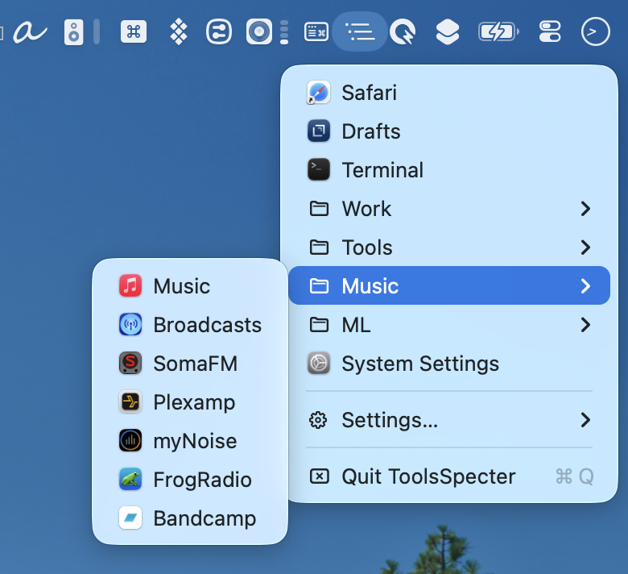

# ToolsSpecter

A hierarchical launcher menu for the macOS menu bar, inspired by **ToolsDaemon** on the Amiga — a user-arranged tree of text menus that launches your apps and tools from anywhere.

ToolsSpecter lives as a small icon on the right side of the menu bar. Click it to open your own, self-organized menu: group items into folders and submenus, launch apps/files/URLs or run shell tools, all without touching the Dock or Spotlight.



## Editing your menu

Every launcher is arranged visually in the built-in editor — nest items into folders, reorder with drag & drop, or drag apps straight in from Finder.


## Features

- **Hierarchical text menus** — organize launchers into folders and nested submenus, the ToolsDaemon way
- **Menu bar residence** — a lightweight status-bar item (no Dock icon); pick from several glyph styles
- **Launch anything** — applications, files, URLs, and shell commands
- **Real app icons** in the menu
- **Built-in app scanning** of `/Applications`, `/System/Applications`, `~/Applications`, and `~/Apps`, plus **Scan Folder…** to add any other location
- **Visual editor** (Settings… → Edit menu…) — add apps/folders/URLs/files/shell tools/separators, rename, reorder, nest and move items via drag & drop, or drag apps straight in from Finder
- **Live config** — every change is saved to `~/Library/Application Support/ToolsSpecter/config.json` and reflected the next time the menu opens
- **Open at Login** support
- No Xcode project needed — build with a single script

## Requirements

- macOS 13+
- Xcode Command Line Tools (for `swift build`)

## Build & run

```sh
./scripts/make-app.sh
open build/ToolsSpecter.app
```

The script compiles in release mode, assembles `build/ToolsSpecter.app`, and ad-hoc codesigns it.

To enable **Open at Login**, move the app into place first:

```sh
cp -R build/ToolsSpecter.app /Applications/
```
